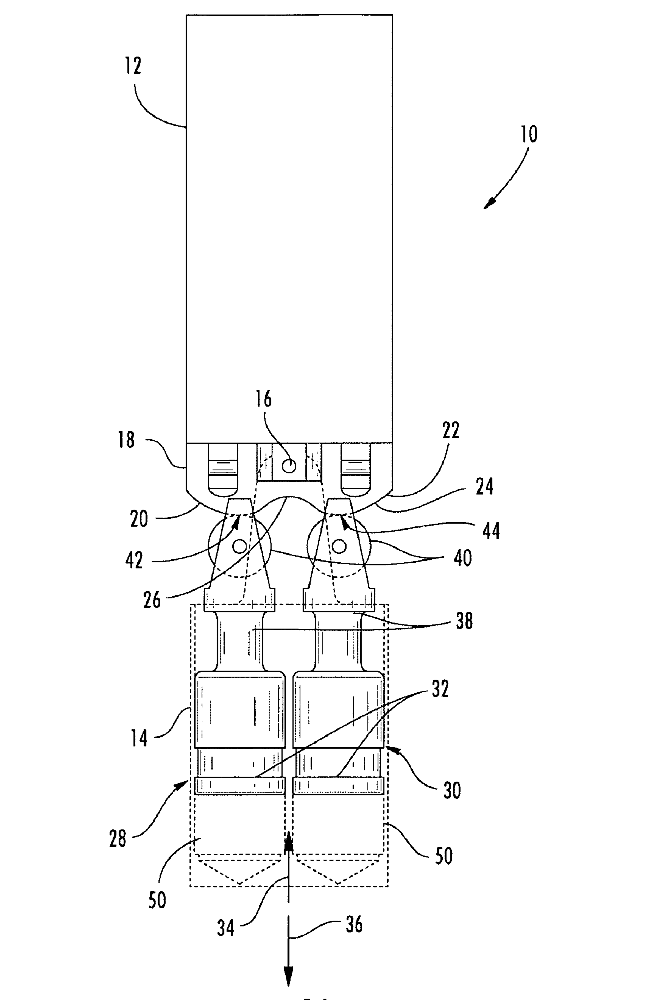
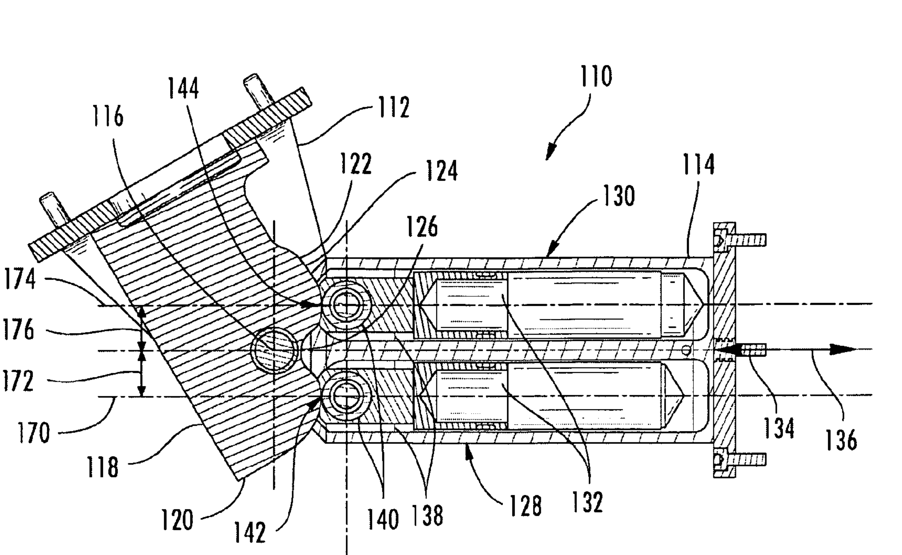
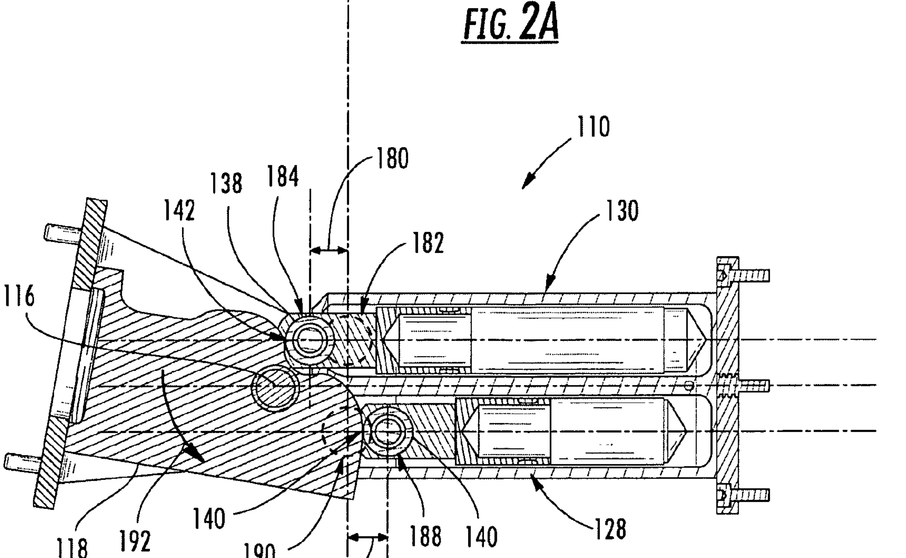
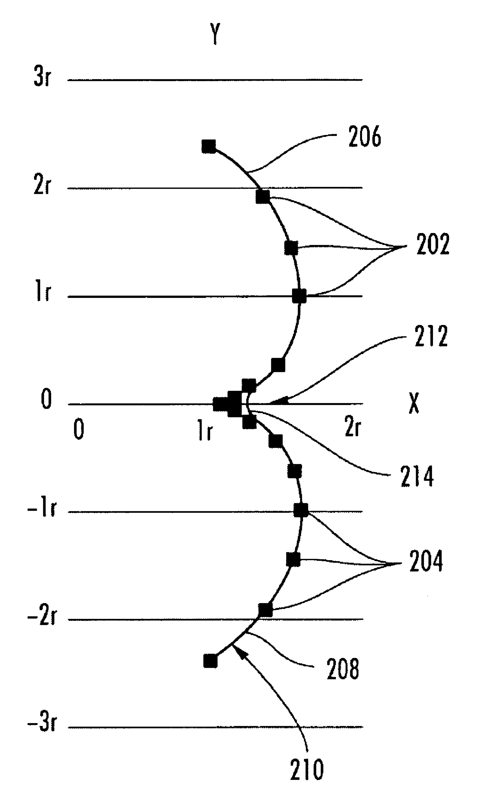
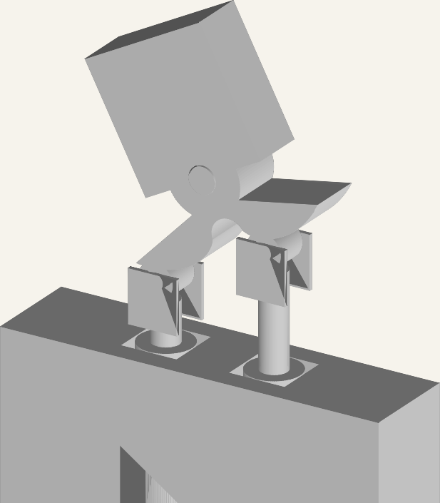

# Converting a US Patent to CAD with AI

## Mechanical-Reasoning Case Study

Hydraulic Involute Cam Actuator  
US Patent `8,047,094 B2`

<!--
Frame this version as an engineering debugging story.
The point is not that AI generated CAD in one shot.
The point is that the model converged only after the mechanism was expressed as constraints, motion, and contact geometry.
-->

---

## Why This Matters

AI changes the front end of CAD work by compressing the distance between:

- an idea in language
- a mechanism sketch
- a structured kinematic model
- an editable parametric artifact

<div class="panel">

For engineering teams, the interesting question is not "can AI draw geometry?"
It is whether AI can help us move from vague intent to a **mechanically meaningful starting point** faster.

</div>

<!--
Use this slide to broaden the frame before the patent example.
The audience already knows CAD; the value proposition is speed of iteration and earlier access to structured design space.
-->

---

## AI As An Idea-To-CAD Multiplier

<div class="two-col">
<div class="panel">

**What AI is good at**

- translating prose into structure
- proposing part decompositions
- generating parametric code quickly
- iterating on critique without starting over

</div>
<div class="panel">

**What still requires rigor**

- coordinate consistency
- joint and contact correctness
- validation of motion
- preserving editability and intent

</div>
</div>

<!--
This slide sets expectations correctly for an engineering audience.
AI is an accelerator on decomposition and iteration, not a replacement for mechanism verification.
-->

---

## Talk Structure

1. Why AI is useful for turning ideas into CAD
2. Why this patent is a useful stress test
3. How the example evolved from a wrong shape to a working mechanism
4. What the workflow suggests about future AI CAD systems

<div class="small">
Target pacing: roughly 2 minutes per slide, with a little more time on the contact-geometry and final-assembly sections.
</div>

<!--
This helps the talk land as a 30-minute internal demo rather than a quick walkthrough.
-->

---

## What We Wanted

Turn patent figure `1A` into a **mechanically coherent** `OpenSCAD` model.

<div class="two-col">
<div class="panel">

**Inputs**

- Patent figure and claims
- Equations for the involute geometry
- Iterative user feedback

</div>
<div class="panel">

**Required behavior**

- Two parallel hydraulic pistons
- Rollers at the piston ends
- Dual involute cam surface
- One rotating arm/cam body

</div>
</div>

<div class="figure">

<div class="caption">Patent Figure 1A: the reference geometry that anchored the reconstruction.</div>
</div>

<!--
Make the success criterion explicit for engineers: visually similar was not enough.
The assembly had to preserve the intended rotary-linear coupling and stay contact-consistent over motion.
-->

---

## Why This Benchmark Is Technically Useful

- The source is under-specified but still contains hard geometric constraints
- It forces figure interpretation, kinematic decomposition, and contact reasoning in one loop
- The mechanism spans multiple local frames that must be reconciled globally
- Small offset errors create visible contact failure
- The final artifact must be editable CAD, not just a mesh or screenshot

<!--
This is the benchmark framing for an internal audience.
The point is that this task stress-tests parsing, kinematics, geometry, and verification at once.
-->

---

## First Attempt: Correct Math, Wrong Mechanism

<div class="two-col">
<div class="panel">

**What the model did**

- Read claim equations
- Generated involute-like lobes
- Extruded a cam-like body in `OpenSCAD`

</div>
<div class="panel">

**What was missing**

- Real piston-roller coupling
- Proper orientation of the actuators
- Verified contact between rollers and cam

</div>
</div>

<div class="panel">

The first pass used the patent equations as if they were sufficient to define the assembly.
The user feedback made clear that the missing piece was not more math, but a better account of **how the rollers, pistons, and cam actually interact**.

</div>

<!--
Emphasize that the early failure was useful.
It exposed the difference between copying an equation and reproducing a machine.
-->

---

## Reframing The Problem

The user tightened the brief from "implement the figure" to a physical interpretation:

- two pistons
- parallel cylinders
- rollers on the rod ends
- dual involute surface
- a single fused part for body `12` and the cam

<div class="panel">

This changed the task from drawing to **mechanism reconstruction**.

</div>

<!--
This slide marks the transition from geometry-first to physics-first reasoning.
That shift is the backbone of the case study.
-->

---

## Build The Kinematic Chain

<div class="two-col">
<div class="panel">

**Fixed structure**

- Base housing (`14`)
- Main pivot (`16`)

**Prismatic motion**

- Left piston
- Right piston

</div>
<div class="panel">

**Rotary motion**

- Arm and cam body (`12` + `18`)

**Coupling**

- Roller contact maps linear travel into rotation

</div>
</div>

Key relation:

`Delta y = r * Delta theta`

<!--
Say this relation out loud.
It became the organizing equation for later alignment and contact fixes.
-->

---

## Add Intermediate Representations

The workflow improved when the mechanism was described in multiple forms:

- part list and orientations
- equations of motion
- a kinematic-chain interpretation
- `URDF` with revolute and prismatic joints
- back into `OpenSCAD` for geometry and animation

<div class="small">
Representation changes were not overhead. They were what made the problem tractable.
</div>

<!--
This is where you connect AI capability to structured decomposition.
The model performed better when the latent structure was made explicit.
-->

---

## Coordinate Consistency Became Critical

- Cylinders, rods, rollers, and cam were initially inconsistent across frames
- The hydraulic rod moved in the right direction only after orientation fixes
- The roller axis had to align with the pivot axis so the roller could actually roll
- The cam had to be repositioned to face the rollers from the correct side

<div class="two-col">
<div class="figure">

<div class="caption">Figure 2A: side view of the paired cylinders and pivoting body.</div>
</div>
<div class="figure">

<div class="caption">Figure 2B: alternate side position clarifying the actuator relationship through motion.</div>
</div>
</div>

<!--
This is a practical reminder that many CAD-generation failures are frame failures.
The parts may each look reasonable, but the assembly is wrong.
-->

---

## The Breakthrough: Solve Contact Geometry

The final iterations focused on one question:

**Where exactly is the roller-to-cam contact point through the full motion range?**

<div class="panel">

- The roller must keep a single point of contact
- It cannot separate from the cam
- It cannot intrude into the cam
- Contact must hold while the arm rotates and the pistons translate

</div>

<!--
This is the technical climax of the deck.
The audience should understand that contact geometry, not syntax or code generation, was the real bottleneck.
-->

---

## Final Geometric Correction

<div class="two-col">
<div class="panel">

```text
Neutral contact depth = -r * (pi / 2)
Roller center lies on the pitch curve
Cam surface is the inward offset of that pitch curve
```

The earlier gap came from effectively subtracting the roller radius twice.

Once that offset error was removed, the rollers maintained contact without penetrating the cam.

</div>
<div class="figure">

<div class="caption">Figure 3: the involute-style reference curve that informed the contact reasoning.</div>
</div>
</div>

<!--
This is the cleanest place to explain the exact fix.
If the audience is less technical, stress the intuition: contact points live on the pitch curve, not on the offset surface.
-->

---

## Final Assembly

<div class="two-col">
<div class="panel">

**Rotating body**

- fused cam lobes
- central hub
- upper arm mass
- one solid part for body `12`

</div>
<div class="panel">

**Actuation**

- rollers at `x = +/- r`
- piston displacement computed from `theta`
- `cam_vertical_offset` exposed for tuning

</div>
</div>

<div class="figure">

<div class="caption">Rendered reconstruction of the final actuator assembly based on the final OpenSCAD model.</div>
</div>

<!--
Mention that parameterization mattered.
It gave the user a way to tune fit without re-deriving the mechanism.
-->

---

## What This Example Demonstrates

- AI can accelerate patent-to-CAD conversion
- It works best when the system is expressed as **constraints**, not just text
- Intermediate kinematic representations reduce ambiguity
- Human review remains essential for geometry, contact, and orientation
- The most useful loop was: **generate -> inspect -> formalize -> regenerate**
- The evaluation target should be **behavioral correctness**, not visual similarity alone

<!--
Use this as the synthesis slide.
The takeaway is about workflow design, not just model capability.
-->

---

## Suggested Live Demo

- Show patent figure `1A`
- Show the first wrong render
- Show the kinematic relation and `URDF` abstraction
- Show the final animation with roller-cam contact visible
- End on the key lesson: **mechanical reasoning closed the gap**

<!--
Close with the contrast between the first and final models.
That makes the improvement tangible.
-->

---

## Closing Thought

The practical power of AI in CAD is not just that it can produce geometry.

It can help engineers move from:

- rough intent
- to structured mechanism hypotheses
- to editable models
- to a faster verification loop

<div class="panel">

The patent example is compelling because it shows both the opportunity and the bar: the useful system is the one that helps us reason our way to a correct model faster.

</div>

<!--
End by connecting the technical case study back to the broader idea-to-CAD theme.
-->
